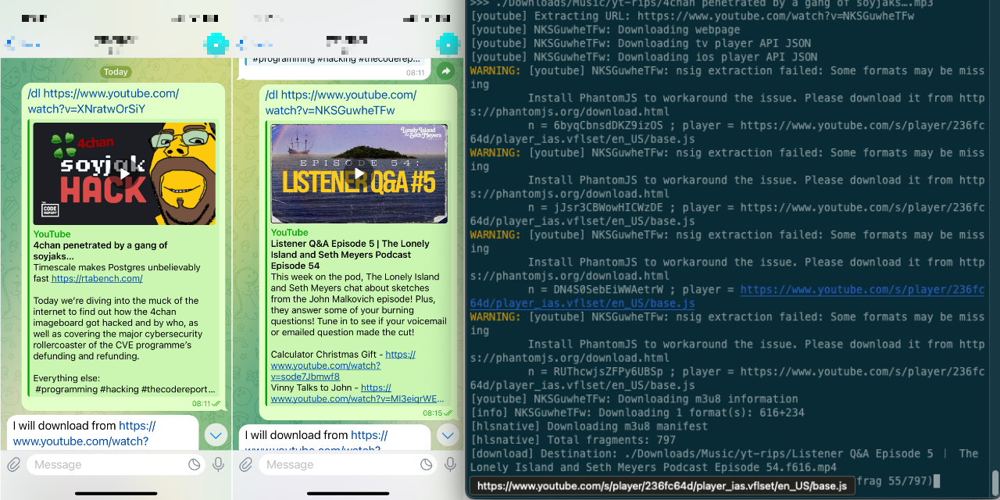

# YT2mp3: a Telegram Bot

## Download YouTube videos as mp3

This Telegram Bot will accept a `/url` command action followed by a YouTube URL, download the resource using `yt-dlp` and save an mp3 file to a designated folder.
Very useful to turn your favourite YT shows into downloaded podcasts (where watching is not required).
How you play them back is out of the scope of this script.

Since it depends on the correct functioning of `yt-dlp`, if you get errors make sure your yt-dlp is up-to-date.



## Requirements

* [create your Telegram Bot](https://core.telegram.org/bots/tutorial) first.
* Terminal shell (works on Mac OS and Linux, Windows sounds like a "you" problem)
* Python3
* Pip3

## Installation

Make sure you are running Python 3 and pip.
Depending on how the commands are aliased on your system you may have to run them in different ways.

e.g.:

```shell
pip install -r requirements.txt
```

vs

```shell
pip3 install -r requirements.txt
```

## Usage

```shell
chmod +x downloader.py
./downloader.py
```

If everything worked well you can start sending messages to your bot and get it to download mp3 of any YT video for you.

## Commands

### `/hello`
The bot will respond to `/hello` with "Hello YOUR_NAME".

### `/dl`
The bot will process the URL and download the content to mp3.
`/dl https://www.youtube.com/watch?v=dQw4w9WgXcQ`
